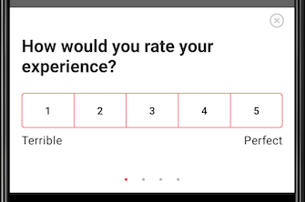

# Android SDK Implementation

## Initializing the SDK

In order to use the SDK, you need to configure the SDK for your app. Do this before calling any other UserLeap functions. A convenient place to configure UserLeap is in your class that extends [Application](https://developer.android.com/reference/android/app/Application).

```java
UserLeap.configure(context, "YOUR_ENVIRONMENT_ID")
```

The `ENVIRONMENT_ID` for your deployment can be found in the [Connect](https://app.userleap.com/connect) page of the UserLeap Dashboard.

## **Verifying your SDK Installation**

You can verify you’ve set up the installation and environment ID correctly by adding the following line:

```java
UserLeap.presentDebugSurvey(activity)
```

This survey always displays a debug survey and the results are submitted to UserLeap.

## **Identifying users**

### **User ID**

UserLeap allows you to identify users by supplying a userId. While tracking userIds is optional,  it helps to provide a consistent experience across platforms and prevents users from seeing the same survey multiple times.

The user identifier should be unique and mappable to your internal user id in some way. 

Set the userId after configuring if they are already logged in or after the user logs in to your app:

```java
UserLeap.setUserIdentifier("USER_ID")
```

This user identifier is stored locally and this method can be called multiple times safely. We recommend you set the user identifier every time you configure UserLeap and anytime your customers login to be safe.


**IMPORTANT:** UserLeap enforces resurvey windows and survey eligibility based on the user ID associated with the current user, and tracks this user ID across multiple sessions and devices. If no user ID is provided, UserLeap will only enforce resurvey windows against the current anonymous visitor ID.


### **Email address**

You can also provide UserLeap with the user's email address. It is not required for Web and Mobile surveys, but is required to enable Email-based surveys.

```java
UserLeap.setEmailAddress("example@email.com")
```

## **Segmenting your** users **with attributes**  

UserLeap allows you to associate attributes to each user. These attributes are surfaced as survey filter options in the UserLeap dashboard, and allow you to send surveys to users with certain attributes.

```java
UserLeap.setVisitorAttribute("key", "value")
```

UserLeap automatically tracks and attaches the following attributes:

* App version
* Android version
* SDK version

Some common attributes you can set are:

* Location
* Referral channel
* A/B test group
* Network connectivity status
* Battery level

## Tracking user events

Let’s track the event that you created in [Setting up your first survey](../../../product-workflows/launch-a-survey.md). You can track UserLeap events, inside your mobile app, by calling the `track()` function and passing the event name as a function argument. 


Your engineering team will want to place`track()`code after any action or context, denoting to UserLeap that the event has occurred.


```java
UserLeap.track("YOUR_TRACKING_EVENT")
```

These events can be used as part of your filters for triggering a survey, but will not display a survey to your users.

## Displaying **surveys to users**

Instead of strictly tracking when user events occur, we can send events to UserLeap and also display a survey, should the user qualify for one. We can do this by modifying the prior `track()` call, and adding in a `when` statement as follows:

```java
UserLeap.track("YOUR_TRACKING_EVENT") { surveyState ->
    when (surveyState) {
        SurveyState.READY -> {
            // We received a survey for the event, present it to the user
            UserLeap.presentSurvey(activity)
        }
        SurveyState.NO_SURVEY -> {
            // No survey available based on event
        }
        SurveyState.DISABLED -> {
            // UserLeap has been disabled remotely
        }
    }
}
```

After sending each tracking event, you can check if a new survey is ready for the user. If a survey is ready, you can decide to present the survey to the user. The survey is presented on a [modal bottom sheet](https://material.io/develop/android/components/bottom-sheet-dialog-fragment/).



### **Verifying your Event-based Surveys**

We have checks in place to make sure we show surveys at the right time \(See [Survey Eligibility](../../../product-definitions/re-survey-windows.md)\). To test that your surveys show with the right attributes and events set, be sure to setup the SDK with your **development** `ENVIRONMENT_ID`. This will bypass throttling and the re-survey window.


**IMPORTANT:** While surveys can be configured to trigger and display from multiple events, only one of those events needs to occur to display a survey \(assuming a user also meets your survey's filter criteria\).


## User logout

When a user logs out of your app, make sure to log that user out of the UserLeap SDK. This will prevent any new activity being associated with the wrong user.

```java
UserLeap.logout()
```

