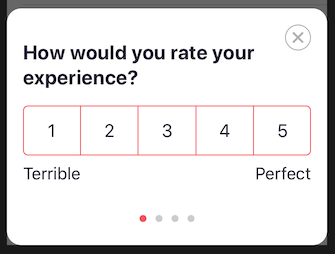

# iOS SDK Implementation

## Initializing the SDK

Usage is simple and revolves around a singleton, conveniently named `UserLeap`. The singleton must be configured before it can be used. The most obvious place for this is in your `ApplicationDelegate`, but do what's appropriate for your application.

```swift
import UserLeapKit

class AppDelegate: UIResponder, UIApplicationDelegate {
    func application(_ application: UIApplication, didFinishLaunchingWithOptions launchOptions: [UIApplication.LaunchOptionsKey: Any]?) -> Bool {
        //your app setup
        UserLeap.shared.configure(withEnvironment: "ENVIRONMENT_ID")
        return true
    }
}
```

The `ENVIRONMENT_ID` for your deployment can be found under the iOS section of your [Connect page](https://app.userleap.com/connect), in the UserLeap dashboard.

**Note: `configure` will only accept 1 environment id, calling it multiple times with different IDs will have no effect.**

## **Verifying your SDK Installation**

You can verify you’ve set up the installation and environment ID correctly by adding the following line:

```swift
UserLeap.shared.presentDebugSurvey(from: self)
```

This presents a test survey, assuming everything has been configured correctly.

## **Identifying** users

### **User ID**

UserLeap allows you to identify users by supplying a `userId`. While tracking user IDs is optional,  it helps to provide a consistent experience across platforms and prevents users from seeing the same survey multiple times.

The user identifier should be unique and mappable to your internal user id in some way.

Once a user has logged in to the app, you can set their `userId`:

```swift
UserLeap.shared.setUserIdentifier("myUserId")
```

This user identifier is stored locally and this method can be called multiple times without issue. We recommend you set the user identifier every time you configure UserLeap, and anytime your customers login.


**IMPORTANT:** UserLeap enforces resurvey windows and survey eligibility based on the user ID associated with the current user, and tracks this user ID across multiple sessions and devices. If no user ID is provided, UserLeap will only enforce resurvey windows against the current anonymous visitor ID.


### **Email address**

You can also provide UserLeap with the user's email address. It is not required for Web and Mobile surveys, but is required to enable Email-based surveys.

```swift
UserLeap.shared.setEmailAddress("example@email.com")
```

## **Segmenting your** users **with attributes**  

UserLeap allows you to associate attributes to each user. These attributes are surfaced as survey filter options in the UserLeap dashboard, and allow you to send surveys to users with certain attributes.

```swift
//Example of setting a single attribute
UserLeap.shared.setVisitorAttribute(key: "key", value: "value")

//Example of setting multiple attributes
//TIP: This avoids  multiple requests, rounds trips and reduces data usage
UserLeap.shared.setVisitorAttributes([
    "key1": "value1",
    "key2": "value2"
])

//Remove attributes, if they no longer apply to the user
UserLeap.shared.removeVisitorAttributes(["key1", "key2"])
```

UserLeap automatically tracks and attaches the following attributes to each user:

* App version
* iOS version
* SDK version
* Device type
* System Language

Some common attributes your team might want to consider setting:

* Location
* Referral channel
* A/B test group
* Network connectivity status
* Battery level

## Tracking user events

Let’s track the event that you created in [Setting up your first survey](../../../product-workflows/launch-a-survey.md). You can track UserLeap events, inside your mobile app, by calling the `trackEvent()` function and passing the event name as a function argument. 


Your engineering team will want to place`trackEvent()`code after any action or context, denoting to UserLeap that the event has occurred.


```swift
UserLeap.shared.trackEvent(eventName: "[TEST] My first event")
```

These events can be used as part of your filters for triggering a survey, but will not display a survey to your users.

## Displaying surveys to users

Instead of strictly tracking when user events occur, you can send events to UserLeap and also display a survey, should the user qualify for one. We can do this by modifying the prior `trackEvent` call, and adding in a `switch` statement as follows:


UserLeap will automatically check if a user is eligible based on your survey's filter constraints, and determine survey eligibility for you. Your team does not need to code additional logic that validates a user's attribute criteria, before sending events to us.


```swift
UserLeap.shared.trackEvent(eventName: "[TEST] My first event") { state in
	switch state {
		case .ready:
			UserLeap.shared.presentSurvey(from: viewController)
		case .noSurvey, .disabled:
			break
	}
}
```



### **Verifying your Event-based Surveys**

We have checks in place to make sure we show surveys at the right time \(See [Survey Eligibility](../../../product-definitions/re-survey-windows.md#resurvey-windows)\). To test that your surveys show with the right attributes and events set, be sure to setup the SDK with your **development** `ENVIRONMENT_ID`. This will bypass throttling and the re-survey window.


**IMPORTANT:** While surveys can be configured to trigger and display from multiple events, only one of those events needs to occur to display a survey \(assuming a user also meets your survey's filter criteria\).


## User logout

When a user logs out of your app, make sure to log that user out of the UserLeap SDK. This will prevent any new activity being associated with the wrong user.

```swift
UserLeap.shared.logout()
```

## \*\*\*\*

