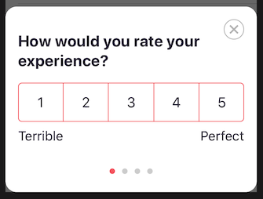

# React Native Module

Official React Native module for UserLeap

## Getting Started

Refer to the [iOS](https://docs.userleap.com/installation/ios-sdk) documentation for platform specific requirements and resources. 

Refer to the [Android](https://docs.userleap.com/installation/android-sdk) documentation for platform specific requirements and resources.

Note: **the module currently supports Android SDK Version 21 \(Lollipop, OS 5.0\) and above**. Any calls to the UserLeap module from Android OS below version 21 are no-op.

## Installation

Add the module to your `package.json` dependencies.

```bash
yarn add react-native-userleap
```

for iOS you need to do `pod install` first. And if you are updating it's best to remove the `Podfile.lock` and run `pod repo update`first. So from your app top level directory, do:

```bash
cd ios
rm Podfile.lock
pod repo update
pod install
```

## Initializing the Module

Usage is simple and revolves around a singleton, conveniently named `UserLeap`. The singleton must be configured before it can be used. The most obvious place for this is in your app's entry point, but do what's appropriate for your application.

```jsx
import UserLeap from 'react-native-userleap'

UserLeap.configure('ENVIRONMENT_ID');
```

The `ENVIRONMENT_ID` for your deployment can be found in the [**Connect**](https://app.userleap.com/connect) tab

**Note:** `configure` will only accept 1 environment id, calling it multiple times with different IDs will have no effect.

## **Verifying your Module Installation**

You can verify you’ve set up the installation and environment ID correctly by adding the following line:

```jsx
UserLeap.presentDebugSurvey();
```

This presents a test survey if everything has been configured correctly.

## **Identifying** users

### **User ID**

UserLeap allows you to identify visitors by supplying a userId. While tracking userIds is optional,  it helps to provide a consistent experience across platforms and prevents users from seeing the same survey multiple times.

The user identifier should be unique and mappable to your internal user id in some way. 

Set the userId after configuring if they are already logged in or after the user logs in to your app:

```jsx
UserLeap.setUserIdentifier('myUserId');
```

This user identifier is stored locally and this method can be called multiple times safely. We recommend you set the user identifier every time you configure UserLeap and anytime your customers login to be safe.

### **Email**

You can also provide UserLeap with the user's email address. It is not required for Web and Mobile surveys, but is required to enable Email-based surveys.

```jsx
UserLeap.setEmailAddress('example@email.com');
```

## **Segmenting your** users **with attributes**

UserLeap allows you to associate attributes to each user. These attributes are surfaced as survey filter options in the UserLeap dashboard, and allow you to send surveys to users that meet certain attributes and conditions.

```jsx
UserLeap.setVisitorAttribute('key', 'value');
```

UserLeap automatically tracks and attaches the following attributes:

* App version
* iOS/Android version
* SDK version
* Device type
* System Language

Some common attributes to set are

* Location
* Referral channel
* A/B test group
* Network connectivity status
* Battery level

## Tracking user events

Let’s track the event that you created in [Setting up your first survey](../../product-workflows/launch-a-survey.md). You can track UserLeap events, inside your mobile app, by calling the `track()` function and passing the event name as a function argument. 


Your engineering team will want to place`track()`code after any action or context, denoting to UserLeap that the event has occurred.


```jsx
UserLeap.track(eventName: '[TEST] My first event')
```

These events can be used as part of your filters for triggering a survey, but will not display a survey to your users.

## Displaying **surveys to users**

Instead of strictly tracking when user events occur, you can send events to UserLeap and also display a survey, should the user qualify for one. We can do this by modifying the prior `trackEvent` call, and adding in a `switch` statement as follows:


UserLeap will automatically check if a user is eligible based on your survey's filter constraints, and determine survey eligibility for you. Your team does not need to code additional logic that validates a user's attribute criteria, before sending events to us.


```jsx
UserLeap.track('[TEST] My first event', (surveyState) => {
  switch(surveyState) {
    case UserLeap.SurveyState.READY:
      UserLeap.presentSurvey();
      break;
    case UserLeap.SurveyState.NO_SURVEY:
      break;
    case UserLeap.SurveyState.DISABLED:
      break;
  }
});
```



### **Verifying your Event-based Surveys**

We have checks in place to make sure we show surveys at the right time \(See [Survey Eligibility](../../product-definitions/re-survey-windows.md)\). To test that your surveys show with the right attributes and events set, be sure to setup the SDK with your **development** `ENVIRONMENT_ID`. This will bypass throttling and the re-survey window.


**IMPORTANT:** While surveys can be configured to trigger and display from multiple events, only one of those events needs to occur to display a survey \(assuming a user also meets your survey's filter criteria\).


## Logout

When a user logs out of your app, make sure to log that user out of the UserLeap SDK. This will prevent any new activity being associated with the wrong user.

```jsx
UserLeap.logout();
```

