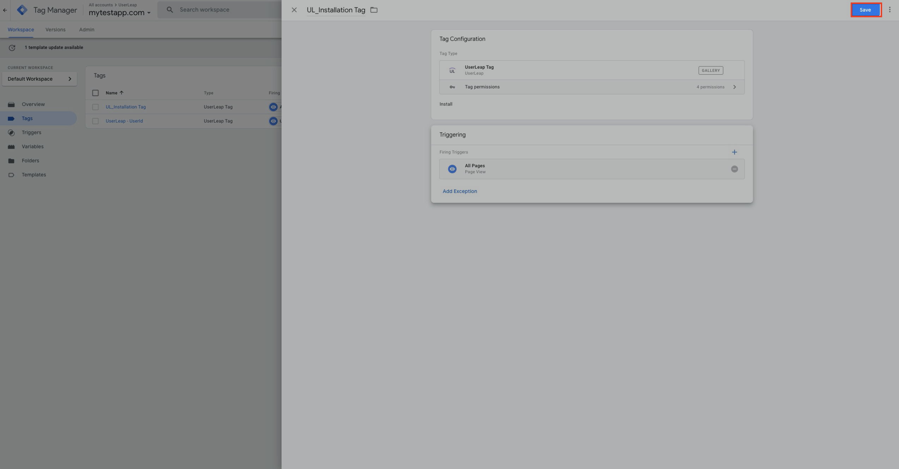

# Base Install

## Installing UserLeap Javascript

_If you have any questions, please reach out to success@userleap.com or contact us via the in-product help chat_

To install the UserLeap codebase, you’ll need to do these two things:

1. Create an environment ID variable and add it to Google Tag Manager
2. Create a tag that consists of your environment ID variable and a trigger \(default to all page views

### 1\) Create an Environment ID Variable

_if you're unsure of where to find the environment ID,_ [_click here_ ]()\_\_



### **Step by Step**

Open up the “Variables” section of Google Tag Manager

Create a new user-defined variable

We’ll name this new variable `UL_EnvID (Production)` and make this a constant variable type

Please add your UserLeap environment ID below and then click “Save"

### **2\) Creating the UserLeap Installation Tag**

Now that we have the environment ID and the trigger \(`All Pages` - in GTM by default\), we can put it all together inside a tag. UserLeap supplies its own custom tag template which can be found in the tag library.



### **Step by Step**

Click “Tags” and then click on “New” 

Let's give the tag a title 

Now we’ll locate the UserLeap tag from the Google Tag Manager library and add our environment ID variable \(`UL_EnvID`\) along with the `All Pages`trigger \(there by default\)

To locate the `UL_EnvID` variable we just created, you'll want to click on the "lego-looking" icon in the "Environment ID" field below. Once finished, click on the triggering portion for us to add our `All Pages` trigger

Once you've added the trigger, click save in the top right 

Finally, we'll submit all our changes. Congrats! You have now installed UserLeap across your webpage/web-based application

