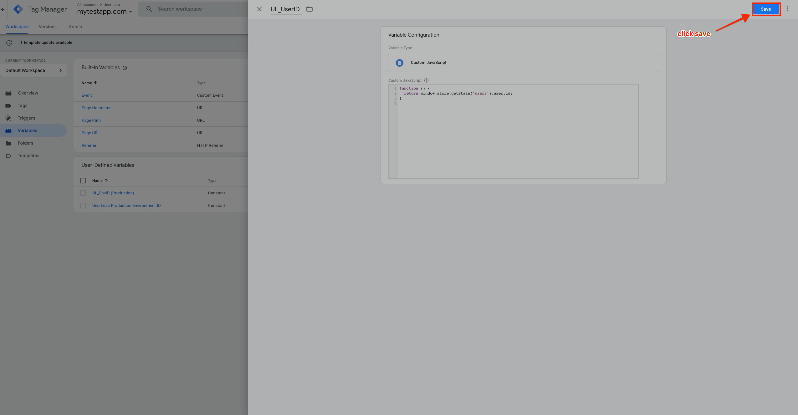

# User Identification

## **Sending UserLeap UserIDs \(Optional, but Recommended\)**

_If you have any questions, please reach out to success@userleap.com or contact us via the in-product help chat_

UserLeap allows you to identify visitors by supplying a userId. While tracking UserIDs is optional,  it provides a consistent experience across platforms and prevents users from seeing the same survey multiple times. Here’s a quick overview of UserLeap’s [**survey eligibility**](../../../product-definitions/re-survey-windows.md) ****window


 UserIds are unique, and the process will differ from client to client. This section is indicative of our own setup. For specific questions, please email **success@userleap.com** or reach out to us via the in-app product support  


## Custom JS Variable __

### **Step by Step**

Open  the "Variables" section, next select "New"

_🚨At this step, you may require some assistance from a developer to determine what function/variable on your website/app stores and assigns user IDs_

Add a custom javascript variable 

Let's add a new trigger specifically for this new `UL_UserID` variable we just created

We can call this trigger `UL_Overview Page & >0`

_Overview Page = URL on UserLeap where I want the app to send visitor userids for tracking_ 

_&gt;0 = Second criteria that MUST be met for the tag to fire. Only fire this tag, \`_`UL_UserID`_is NOT 0_

The trigger we create will be an `Page View` trigger

Remember, all triggers must be contained within a tag before we can deploy them. So next, we'll create another UserLeap tag - this one for `UL_UserID`

Let's give the tag a title `UL_UserID` tag

Now we’ll locate the UserLeap tag from the Google Tag Manager library and add our user ID variable \(`UL_UserID`\) along with our new `UL_Overview Page & >0` trigger 

To add the `UL_EnvID` and `UL_UserID` you'll need to click on the respective 'lego-looking" icon in the image below. Add in the trigger as well. When finished, click "Save"

"Submit" your changes

