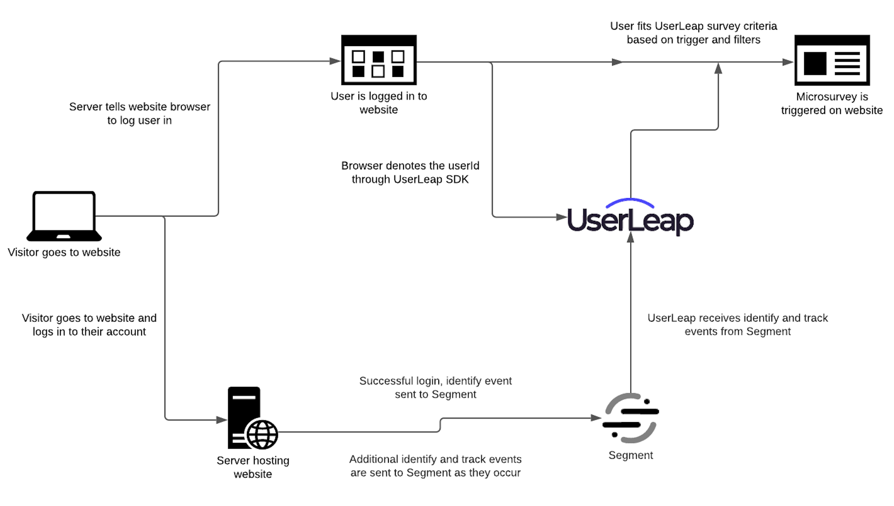

# Segment


**Note:** [Segment events](https://segment.com/docs/connections/destinations/) can only be used as [survey filters](https://docs.userleap.com/product-workflows/interacting-with-survey-filters) in UserLeap. Because Segment events can be received on a delay and do not guarantee a realtime interaction with your visitors, they cannot be used ****to trigger a survey. 

The [UserLeap SDK](../installation/) needs to be installed on your web or mobile application, and should handle any trigger events for surveying within your product.


### Supported Capabilities:

* Send custom events and page visits to UserLeap
* Send user identifier and attributes
* Send email surveys to your users' inbox
* Create link surveys that you can share with your users

### Capabilities requiring the UserLeap SDK:

* Showing a survey on your website
* Showing a survey on your mobile application

### Best practices for sending Segment events

When connecting Segment to UserLeap, it is recommended to filter events and only send events that you're planning to use as filters for your surveys. This can be done within Segment, by setting up [destination filters](https://segment.com/docs/guides/filtering-data/#destination-filters) to choose which events should be sent over to UserLeap. You can always modify your filters to add additional events, as needed.

If destination filters are not available to your team within Segment, you can go to your [UserLeap settings](https://app.userleap.com/settings/configure) and choose  "Disable Auto Accept Events" in the **Auto Accept Events** section. When enabled, you will be able to choose which events UserLeap should start tracking from your [Events](https://app.userleap.com/events) dashboard.

### Connecting Segment to UserLeap

1. From the Segment app Destinations page, find [UserLeap](https://segment.com/integrations/userleap/) click on **Add Destination**.
2. Search for "**UserLeap**" in the Destinations Catalog and Select the UserLeap Destination.
3. Choose which Source should send data to the **UserLeap** Destination.
4. Go to your [Connect page](https://app.userleap.com/connect), click on the **Segment** card.
5. Find and copy the **Segment** API key for the UserLeap environment that is going to be receiving events.  \(If you don't see a Segment API Key, please reach out to support@userleap.com\).
6. Enter the Segment API Key that you copied in the UserLeap destination settings in Segment.



### Associating Segment data to UserLeap visitors <a id="identify"></a>


**IMPORTANT:** In order for Segment data to be tied to your visitors within UserLeap, you must associate your visitors with their respective user ID through the UserLeap SDK. Based on this user ID, we will match any events and attributes received from Segment, for that user.


Here's example code of what this would look like across our different SDKs:

```javascript
// UserLeap Web SDK
UserLeap.setUserId('userId123');
```

```javascript
// UserLeap iOS SDK
UserLeap.shared.setUserIdentifier('userId123')
```

```javascript
// UserLeap Android SDK
UserLeap.setUserIdentifier('userId123')
```

### Segment - Identify <a id="identify"></a>

If you’re not familiar with the Segment Specs, take a look to understand what the [Identify method](https://segment.com/docs/connections/spec/identify/) does. An example call would look like:

```text
analytics.identify('userId123', {
  firstName: 'James',
  lastName: 'Gibbon'
});
```

Use Segment’s Identify method to identify your users in UserLeap. Segment `traits` map to UserLeap `attributes`.

**Important:** Only Identify calls can create new users in UserLeap.

### Segment - Alias <a id="alias"></a>

If you’re not familiar with the Segment Specs, take a look to understand what the [Alias method](https://segment.com/docs//connections/spec/alias/) does. An example call would look like:

```text
analytics.alias('newUserId');
```

This does exactly the same thing as identify without the attributes.

### Segment - Track

If you’re not familiar with the Segment Specs, take a look to understand what the [Track method](https://segment.com/docs/connections/spec/track/) does. An example call would look like:

```text
analytics.track('Clicked Button');
```

Use Track calls to track events and use them as filtering criteria for your Surveys.

Create Triggered Events in your UserLeap [Events dashboard](https://app.userleap.com/events) and map them to your Segment Track event names before you start sending Segment data to UserLeap.

### Segment - Page <a id="page"></a>

If you’re not familiar with the Segment Specs, take a look to understand what the [Page method](https://segment.com/docs/connections/spec/page/) does. An example call would look like:

```text
analytics.page();
```

Segment sends Page calls to UserLeap as a `pageview` which you can use as filtering criteria for your surveys.

Add Page URLs in your UserLeap [Events dashboard](https://app.userleap.com/events) and map them to your Segment Page call’s `properties.url` field before you start sending Segment data to UserLeap.

### Unsupported Segment Events

* Group
* Screen

### Using Segment in UserLeap

In order to launch and trigger microsurveys using a Segment event, you must first [add either a No Code or Code Event ](https://app.userleap.com/events)in the UserLeap UI. 

_The most common of the the two is No Code, specifically a Page URL Event._

Once you create a Page URL Event, you can then set it up to function as the [Survey Trigger,](../product-workflows/launch-a-survey.md) while utilizing your Segment Event\(s\) and attributes as [Survey Filters](https://docs.userleap.com/getting-started/launch-a-survey).

