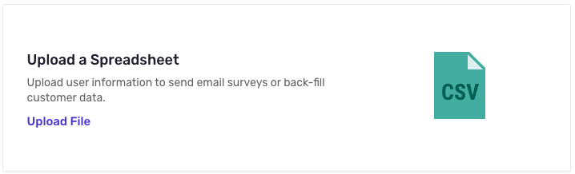

# CSV Import

## Formatting your CSV for UserLeap

We accept a pretty simple standard format with many optional extras

| user\_id | email | attribute1 | attribute2 |
| :--- | :--- | :--- | :--- |
| &lt;any string&gt; | &lt;valid email&gt; | &lt;any string&gt; | &lt;any&gt; |

From the above example, _one of_ `user_id` and `email` are required properties as we need a unique identifier to prevent duplication, `list_name` is recommended, but not required and will be set as a Custom Visitor Attribute for any visitor created with that column. The last column demonstrates setting additional Visitor Attributes with a column name, plus some value, \(rows with no value for the given column will not have an Attribute created in our system\). All user id values are treated as strings by our system, and should be uniquely identifiable by your systems.


If a row in your CSV does not have one of `user_id` or `email` that row will be rejected and no visitor will be created.


```text
# example.csv

user_id,email,list_name,food_preference
1,john@qpublic.eg,First Upload,cheeseburgers
2,jane@doefamily.org,First Upload,poptarts
3,,First Upload,pizza
```

In the above example, one user doesn't have an email input, this is ok so long as there's a `user_id` value, you just won't be able to send them email-based surveys.


The maximum row count for CSV uploads is 65000, if you need to upload more than that, please reach out for assistance.


## Uploading to UserLeap with the API

Make sure you have your UserLeap API key handy, as it's required. You can find that on the[ **Connect Page**](https://app.userleap.com/connect)\*\*\*\*

```text
POST - https://api.userleap.com/v1/users/bulk
```

```text
curl --location --request POST 'https://api.userleap.com/v1/users/bulk' \
-H 'Content-Type: text/csv' \
-H 'Authorization: Bearer <YOUR_API_KEY>' \
--data-binary '<PATH_TO_CSV>'
```

## Uploading to UserLeap through the Dashboard

The formatting for the CSV is the same and the upload can be done through the Dashboard UI. You can find the CSV upload option under Connect &gt; Upload a Spreadsheet



