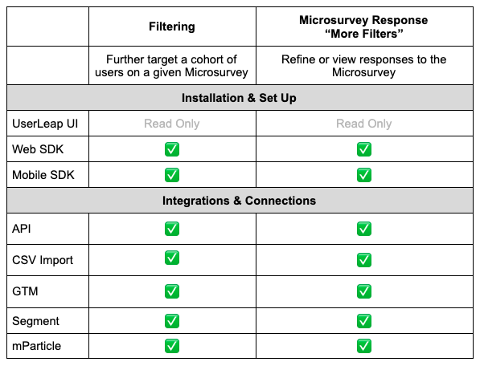

# Attributes

### **What is a UserLeap “Attribute”?**

**Attributes** are a set of key-value pairs made up of Strings, Numbers and Booleans that help you and the UserLeap system to know more information or data about your users as an audience or cohort. Specifically **Attributes** provide more context about the user in order to gain a better understanding of who they are when they come to your application.  Listed below are examples of **Attributes as a set of key-value pairs ✅**

| **Attribute Key** | **Attribute Value** |
| :--- | :--- |
| User Language | Spanish, English, Hindi, Arabic, Bengali, Portuguese, Russian, Chinese |
| User Country | Canada, United Kingdom, India, United States, Brazil, Australia, Germany, France |
| Plan Type | Free, Professional, Standard, Advanced, Enterprise |
| Feature Cohort Stage | Paid Alpha, Paid Beta, Paid Production, Free Small, Free Large |

UserLeap affords 100 distinct **Attribute** values for any given **Attribute** key. In the example above on Plan Type as the **Attribute** _key_, there are 5 distinct **Attribute** _values_ \(Free, Professional, Standard, Advanced and Enterprise\). **Attributes** cannot be deleted, unless the entirety of the data for a given visitor is also deleted. This means that you must be careful when considering an update to the key-value pairs of a given **Attribute**. As an alternative to deleting, you may consider creating a new **Attribute** instead of trying to update the original **Attribute**.

When considering **Attributes**, think of an **Attribute** as a bucket. Ideally avoid placing a data set that has a high degree of “uniqueness” in their values. Listed below are examples of items that should not be **Attributes**

* Unique IDs ⛔
* Device IDs ⛔
* Timestamps for unique events or interactions ⛔ 

### **What is the purpose of an Attribute in UserLeap?** 

| \*\*\*\* |  |
| :--- | :--- |
| \*\*\*\*[**Filtering**](interacting-with-survey-filters-and-triggers.md#attribute-as-filters)\*\*\*\* | **Attributes**, like Events, can be used in a Microsurvey to target and help refine the cohort of users you wish to survey and is described as **Filtering**. Unlike Events, **Attributes** cannot fire or trigger a Microsurvey; they can only **Filter**. |
| **Microsurvey Response “More Filters”** | **Attributes** can also be used as filters to drill into the Microsurvey response data \(once responses are collected and if at least one of the Respondents had \(a\) value\(s\) set for a given **Attribute** when the microsurvey was delivered the responses contain the **Attribute’s** values\) |

Learn more about [Filtering](interacting-with-survey-filters-and-triggers.md#attribute-as-filters) and Microsurvey Response “More Filters”. 

### **How do I manage Attributes?**

Do you have feedback about managing **Attributes**? [Tell us more](https://surveys.userleap.io/534a635666712d3751517e7369643a3232353736).

