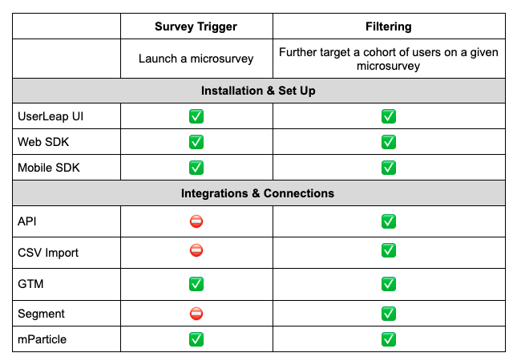

# Events

### **What is a UserLeap “Event”?**

An **Event** is an action that takes place in your web or mobile application that allows you to track their behavior. Examples of **Events** are 

* Visiting a page
* Clicking or interacting with a button
* Scrolling to a specific point on a page

### **What is the purpose of an Event in UserLeap?** 

| \*\*\*\* | \*\*\*\* |
| :--- | :--- |
| **Survey Trigger** | **Events** can be used to Trigger or launch a Microsurvey. It causes your survey to appear. |
| **Filtering** | **Events**, like [Attributes](attributes.md), can also be used as a [Filtering](interacting-with-survey-filters-and-triggers.md#event-as-filters) for a Microsurvey which allows you to further refine who is eligible \(target cohorts\) for answering the Microsurvey.  |

Learn more about Survey Triggers and [Filtering](interacting-with-survey-filters-and-triggers.md#event-as-filters).

### **How do I manage Events in UserLeap?**  

Do you have feedback about managing Events? [Tell us more](https://surveys.userleap.io/534a635666712d3751517e7369643a3232353736).  

